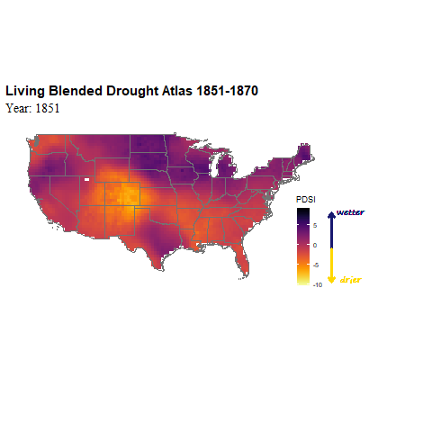

```{r setup, include=FALSE}
knitr::opts_chunk$set(echo = TRUE, message = FALSE, warning = FALSE)
```

A walkthrough for making visualizations in R using data from Ed Cook et. al's Living Blended Drought Atlas. I tried to leave a lot of the process here as a learning tool.

Want to make your own? Change the "all_years", "event_years", "name", and "desc" objects in the "define-variables" code chunk to match your period of interest and run the code. Grab the LBDA_viz.rmd file from my github repository to avoid having to copy/paste all this 
https://github.com/lgsmith295/LBDA_viz

Reach out to me on twitter if you find mistakes or run into trouble!
https://twitter.com/chlorophileB

Data downloaded from: https://www.ncei.noaa.gov/access/paleo-search/study/19119. Values represents summer PDSI (June, July, August) for each year in each gridcell. You want the netCDF file.

Load Packages. You may need to install any you don't already have. Do that using install_packages("nameofpackage")


```{r}
library(raster)
library(sf)
library(sp)
library(ncdf4)
library(tidyverse)
library(ggthemes)
library(gganimate)
library(rnaturalearth)
library(rnaturalearthdata)
library(viridis)
library(extrafont)
#font_import() if this is the  first time using the extrafont package, run this function. It will import fonts found on your system. 
loadfonts(device = c("win", "pdf", "postcript"), quiet = TRUE)
```

Import the LBDA netCDF file from the directory where it is saved, then extract the relevant info and make a raster. Use nc_open() to import the file and ncvar_get() to extract the PDSI data. I used the $ operator for lat, lon, and time.


```{r}

LBDA <- nc_open("data/nada_hd2_cl.nc") #wherever you have saved this

pdsi <- ncvar_get(LBDA, "pdsi") # this is a three dimensional array
lat <- LBDA$dim$lat$vals
lon <- LBDA$dim$lon$vals
time <- LBDA$dim$time$vals

```


Missing values in pdsi are denoted with -99.999. Always avoid using numbers to denote missing values. This could really throw things off if you tried to, for example, calculate the average gridcell value for a region. Replace with NAs.


```{r}

pdsi[pdsi == -99.999] <- NA 

```


I want the state borders to have a lighter color than the country outlines, so I will grab both maps from Rnaturalearth package using ne_states() and ne_countries() functions.


```{r}

states <- ne_states(country = c("United States of America", "mexico", "canada"),  returnclass = "sf")

states <- states %>%
  filter(name != "Alaska", #Alaska because the Aleutian Islands cross the IDL, this was quick and dirty solution as I'm using country outline too
         name != "Hawaii") #No data for Hawaii in LBDA

borders <- ne_countries(country = c("United States of America", "mexico", "canada"), returnclass = "sf")

```

I'll go ahead and define the years I want to show in the animation next, as well as the event years, the name of the event, and an event description. These are the four things to change going forward if you want to make your own animation.

all_years and event_years can be the same, but I want to show the 5 years on either side of the Civil War drought event for context. If you don't want an event name or description, a hacky solution is to put a blank space surrounded by quotes. Ultimately you'll want to remove the text geom from the gganimate object so it doesn't take the time to render with an unnecessary blank bit of text. 


```{r define-variables}
# Define Variables

all_years <- c(1851:1870)
event_years <- c(1856:1865)
name <- "Civil War Drought"
desc <- "Sustained La Niña conditions in Pacific sea surface temperatures caused widespread drought in the central and western United States. This contributed to the near extinction of the Plains Bison in the 19th century."

```

This next step creates a raster layer for each year and puts them all together in a RasterStack called pdsi_stack. I do this in a for loop.


```{r}
ind_years <- all_years + 1 # Using indexing and since the years in LBDA start at 0(not 1), we need to add 1 to match them up


for(i in 1: length(ind_years)){ #for ever year in all_years, create a raster layer and add it to the existing stack
  yr <- ind_years[i]
  pdsi1 <- pdsi[yr, , ]
  rast <- raster(ncol = length(lon), nrow = length(lat),
                 crs = "+proj=utm +zone=48 +datum=WGS84",
                 xmn = min(lon), xmx = max(lon),
                 ymn = min(lat), ymx = max(lat),
                 vals = pdsi1[nrow(pdsi1):1, ])
  if(i == 1){
    pdsi_stack <- stack(rast)
  } else {
    pdsi_stack <- stack(pdsi_stack, rast)
  }
}
```

Check to make sure the first raster layer matches the first year of data, in this case 1851. all.equal Should evaluate to TRUE. I also visually checked it against the drought atlas animation tool at http://drought.memphis.edu/NADA/. An important step! 


```{r}
pdsi_chk <- pdsi[min(ind_years), , ] #first year of the series 1851, but index year 1852
rast_chk <- raster(ncol = length(lon), nrow = length(lat),
               crs = "+proj=utm +zone=48 +datum=WGS84",
               xmn = min(lon), xmx = max(lon),
               ymn = min(lat), ymx = max(lat),
               vals = pdsi_chk[nrow(pdsi_chk):1, ])

all.equal(pdsi_stack[[1]], rast_chk)

plot(pdsi_stack[[1]])

```

Great! now you have a rasterstack object you can use for plotting and analysis. You can write it to a file using the save() function.

I want to use ggplot to make my animation, which means I want the data to be in (really, really) long format. I use the purrr package here to make that dataframe:


```{r}

pdsi_df <- purrr::map_dfr( # return a data frame created by row-binding
  as.list(pdsi_stack), 
  ~setNames(as.data.frame(as(., "SpatialPixelsDataFrame")), c('PDSI', 'x', 'y')),
  .id = "year_id"
)

dim(pdsi_df)
```

A little cleanup is needed now. Since the year_id column isn't the actual year, but an index, I need to make a key to match 1 to the first year, 2 to the second, and so on. Left join the "key" dataframe to "pdsi_df" so that all the values in "pdsi_df" are retained. Then add a column for the name of the event:


```{r}

pdsi_df$year_id <- as.integer(pdsi_df$year_id) # make these integers rather than character

key <- data.frame(cbind(year = all_years, id = sort(unique(pdsi_df$year_id)))) # Match a calendar year to each unique value from the year_id column, both in order from lowest to highest 


pdsi_df <- left_join(pdsi_df, key, by = c('year_id' = "id")) # left join

pdsi_df$name <- factor(ifelse(pdsi_df$year < min(event_years) | pdsi_df$year > max(event_years), " ", name))

```

Finally we will make our first ggplot. I'll use the viridis package for color-blind friendly and all around attractive color scales. I invert the scale so that blue indicates more wet conditions, which is what we are conditioned to expect.


```{r}

g <- ggplot(data = pdsi_df, aes(x = x, y = y, fill = PDSI))  +
  geom_tile() +
  scale_fill_viridis(direction = -1) +
  geom_sf(data = states, fill = "transparent", color = "grey45", inherit.aes = FALSE) +
  geom_sf(data = borders, fill = "transparent", color = "grey33", inherit.aes = FALSE) +
  ggthemes::theme_map() +
  theme(legend.key.width = unit(.70,"cm"), legend.position = c(.10, .10))


g
```


Animate such that each year is a frame with intermediary transition states.


```{r, eval = FALSE}

gganim <- g +  transition_states(year, transition_length = 1, state_length = 0) + #state length = 0 no pause between transitions
  labs(title = 'Year: {closest_state}') + # the year as the title
  theme(plot.title = element_text(size = 20, face = "bold")) +
  geom_text(aes(y = 35, label = name), # adds text 
            x = -60, check_overlap = TRUE)


animate(gganim, fps = 10) #this can take 2-3 minutes

```
```{R}

```


This could use some improving. Transitions are too fast and don't give you a chance to see each year, and the text and legend placement isn't great. I'm also mostly interested in what's happening in the contiguous U.S. for this particular drought, so first I will clip to just the USA minus Hawaii and Alaska. 


```{r}
rm(list=ls()[! ls() %in% c("pdsi_stack", "all_years", "event_years", "desc", "name")]) #clean up environment

us_states <- ne_states(country = c("United States of America"),  returnclass = "sf")

us_states <- us_states %>%
  filter(name != "Alaska", 
         name != "Hawaii")

us_stack <- crop(pdsi_stack, extent(us_states)) #crop and mask from raster package, with us_states object as extent
us_stack <- mask(us_stack, us_states)

# make dataframe same as above

us_df <- purrr::map_dfr( # return a data frame created by row-binding
  as.list(us_stack), 
  ~setNames(as.data.frame(as(., "SpatialPixelsDataFrame")), c('PDSI', 'x', 'y')),
  .id = "year_id"
)

us_df$year_id <- as.integer(us_df$year_id)
key <- data.frame(cbind(year = all_years, id = sort(unique(us_df$year_id))))


us_df <- left_join(us_df, key, by = c('year_id' = "id")) # left join

us_df$name <- factor(ifelse(us_df$year < min(event_years) | us_df$year > max(event_years), " ", name))

us_df$desc <- factor(ifelse(us_df$year < min(event_years) | us_df$year > max(event_years), " ", desc)) #adding the description here

```

Move the legend to the right side and add a title. Because PDSI isn't particularly intuitive, I add a little graphic next to the legend showing which direction is drier/wetter. I also tried the "inferno" color scale.


```{r}
g <- ggplot(data = us_df, aes(x = x, y = y, fill = PDSI))  +
  geom_tile() +
  scale_fill_viridis(direction = -1, option = "B") + #option "B" is inferno, check out the documentation for others
  geom_sf(data = us_states, fill = "transparent", color = "grey45", inherit.aes = FALSE) +
  ggthemes::theme_map() +
  theme(legend.key.width = unit(.50,"cm"), legend.position = c(.68, .25)) +
  scale_x_continuous(limits = c(-125, -48))+ #Added a little extra room for text and graphics 
  scale_y_continuous(limits = c(15, 50)) +
  labs(title = "Living Blended Drought Atlas 1851-1870") +
  theme(plot.title = element_text(size = 15, face = "bold")) +
  geom_segment(aes(x = -63.5, y = 29.6, xend = -63.5, yend = 35.8), #blue up arrow
               arrow = arrow(length = unit(0.2, "cm")), 
               lineend = "round", 
               linejoin = "round", 
               size = 1.2,
               color = "midnightblue") +
  geom_segment(aes(x = -63.5, y = 29.6, xend = -63.5, yend = 24), #gold down arrow
               arrow = arrow(length = unit(0.2, "cm")), 
               lineend = "round", 
               linejoin = "round", 
               size = 1.2,
               color = "gold") +
  geom_text(aes(y = 36, x = -59.5, label = "wetter"), #text beside arrows
              size = 3,
              family = "Segoe Print",
              color = "midnightblue") +
  geom_text(aes(y = 24.5, x = -59.5, label = "drier"), 
              size = 3,
              family = "Segoe Print",
              color = "gold")

g
  

```


Looking better! I would like the animation to move a little slower and pause on each year, which I can adjust in the transition_states() function. I also add the drought description and adjust the placement of that text. The speed, size, and resolution are adjusted in the animate() function. 


```{r, eval = FALSE}

gganim2 <- g +  transition_states(year, transition_length = 1, state_length = 2) + #pauses for twice as long as it takes to transition
  labs(subtitle = 'Year: {closest_state}') + # year as subtitle 
  theme(plot.subtitle = element_text(size = 14, family = "serif")) +
  geom_text(aes(y = 24, label = name), #name of drought, remove if you don't want this to show up
            x = -118, check_overlap = TRUE, size = 4, fontface = "bold") +
  geom_text(aes(y = 20.5, label = str_wrap(desc)), # drought description, remove if you don't want this to show up
            x = -128, check_overlap = TRUE, size = 4, lineheight = .8, hjust = 0)

animate(gganim2, duration = 35, fps = 10) # 35 second total, 10 frames per second

anim_save("USA_anim.gif", animation = last_animation())


```

```{r, out.width = "75%", out.height = "75%"}

```

There you have it. Size and resolution can still use some tweaking. That can be done in the animate() function. 